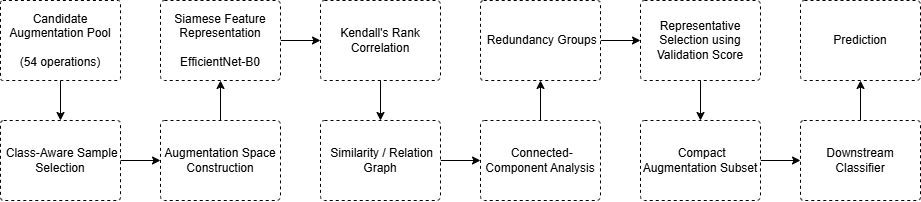
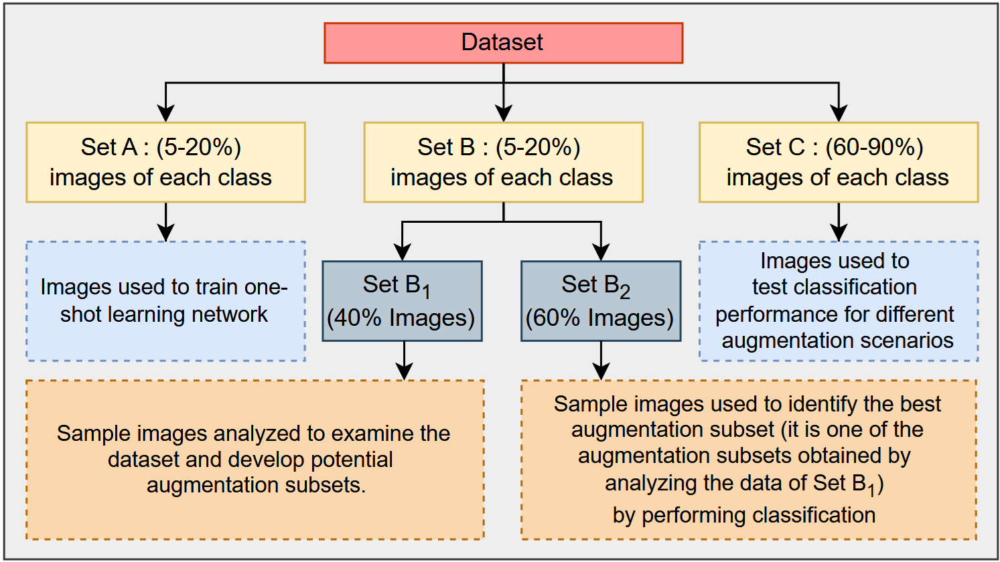

# RASM: Relationship-Aware Augmentation Selection through Structural Redundancy Modeling

[](https://github.com/prasad-iiti/RASM)
[](https://github.com/prasad-iiti/RASM)
[](https://github.com/prasad-iiti/RASM)

Official implementation of **RASM (Relationship-Aware Augmentation Selection through Structural Redundancy Modeling)**.

RASM is a lightweight, classifier-agnostic framework that selects a compact and semantically diverse subset of image augmentation operations by explicitly modeling **structural redundancy among transformations**.

---

## 📄 Paper

**RASM: Relationship-Aware Augmentation Selection through Structural Redundancy Modeling**

**Prasad Kanhegaonkar, Surya Prakash**

The work investigates augmentation selection from a data-centric perspective and proposes structural redundancy modeling to identify groups of semantically related augmentation operations.

> **Status:** Manuscript submitted to *Pattern Recognition Letters*.

---

## Abstract

Data augmentation is essential for improving the generalization of deep learning models, particularly in data-scarce domains such as medical imaging. However, conventional augmentation strategies often overlook redundancy among augmentation operations.

RASM formulates augmentation selection as a **relationship-aware modeling problem**. Candidate augmentation operations are embedded into a learned feature space, where **Kendall's rank correlation** is used to quantify their semantic relationships. These relationships are represented as a similarity graph, and **connected-component analysis** identifies structurally redundant groups.

Rather than retaining multiple semantically similar transformations, RASM selects a representative transformation from each redundancy group, producing a compact and semantically diverse augmentation subset.

Experiments on **HAM10000** and **ISIC2019** demonstrate consistent improvements over standard augmentation while reducing a candidate pool of **54 augmentation operations** to substantially smaller representative subsets. Ablation, sensitivity, low-data, and statistical analyses further evaluate the effectiveness and robustness of the proposed framework.

---

# 🔍 Motivation

Most augmentation pipelines treat transformations independently:

```text
Rotation
Flip
Scale
Color Jitter
Blur
Noise
...
```

A large augmentation pool does not necessarily provide a correspondingly large amount of useful diversity.

Several transformations may produce highly similar effects in the learned representation space. Retaining all of them can therefore:

* introduce redundant training information;
* increase computational cost;
* amplify training noise;
* reduce augmentation efficiency; and
* fail to exploit relationships among transformations.

RASM addresses this issue by asking:

> **Which augmentation operations are structurally redundant, and which operations provide complementary semantic variations?**

Instead of independently ranking transformations, RASM models their **global relationship structure** before selecting augmentations.

---

# 🚀 Key Contributions

RASM makes three main contributions:

1. **Relationship-aware augmentation selection**

   RASM explicitly models structural relationships among candidate transformations rather than performing independent pairwise filtering.

2. **Class-aware sample selection**

   A class-aware sampling strategy is used to obtain representative samples for reliable relationship estimation under severe class imbalance.

3. **Structural redundancy modeling**

   Kendall's rank correlation and graph-based connected-component analysis are used to identify redundancy groups, from which representative transformations are selected.

---

# 🧠 RASM Framework

The RASM pipeline consists of three main stages:

<p align="center">
  
</p>

The complete framework first learns semantic representations of augmentation transformations, then discovers structurally redundant groups, and finally selects one representative transformation from each group.

---

# 1. Relationship Modeling

For every candidate augmentation, RASM applies the transformation to representative training samples.

The resulting augmented samples are embedded into a shared feature space using a **Siamese network consisting of two weight-sharing EfficientNet-B0 branches**.

The Siamese network is trained using a contrastive objective:

$$
L =
y\|z_i-z_j\|^2
+
(1-y)\max(0,m-\|z_i-z_j\|)^2
$$

where:

* \(z_i,z_j\) are embedding representations;
* \(y\in\{0,1\}\) indicates the pair relationship; and
* \(m\) is the contrastive margin.

The Siamese network is used **only for learning augmentation representations**. It is discarded after augmentation selection.

---

# 2. Relationship Quantification

After learning the embedding space, RASM computes the relationship between augmentation operations using **Kendall's rank correlation**.

For two augmentations \(a_k\) and \(a_l\):

$$
S_{k,l}=\tau(z_k,z_l)
$$

where \(\tau\) denotes Kendall's rank correlation coefficient.

The resulting matrix

$$
S\in\mathbb{R}^{K\times K}
$$

provides a global representation of relationships within the augmentation space.

---

# 3. Structural Redundancy Modeling

The relationship matrix is converted into an undirected graph:

$$
G=(V,E)
$$

where:

* each vertex represents an augmentation operation; and
* an edge is created when the relationship strength exceeds the similarity threshold \(\theta\).

$$
E=\{(v_k,v_l)\mid S_{k,l}\geq\theta\}
$$

Strongly connected transformations are treated as structurally redundant groups.

RASM then applies **connected-component analysis using depth-first search (DFS)** to discover these groups.

This is important because redundancy is not restricted to isolated pairs. Transitive relationships can reveal larger groups of mutually related transformations.

---

# 4. Relationship-Aware Representative Selection

After redundancy groups are identified, RASM does **not** simply select an arbitrary transformation.

For each redundancy group \(R_i\), every candidate augmentation is evaluated using a lightweight validation procedure.

The representative is selected as:

$$
a_i^* =
\arg\max_{a_k\in R_i}\phi(a_k)
$$

where \(\phi(a_k)\) represents the validation performance of augmentation \(a_k\).

Therefore, RASM separates:

```text
Redundancy Discovery
        ↓
Graph structure / connected components

from

Representative Selection
        ↓
Validation performance
```

This separation is a key aspect of the framework.

---

# 5. Class-Aware Sampling

Skin lesion datasets are strongly class imbalanced. Using an unbalanced sample for relationship modeling can cause the learned augmentation relationships to be dominated by majority classes.

RASM therefore uses a **class-aware sampling strategy**.

The sampling percentage is determined using negative log-frequency weighting followed by normalization and scaling.

The resulting sampling range is:

**5%–20% per class**

with majority classes contributing approximately 5% and minority classes contributing up to 20%.

This produces representative samples while retaining most images for downstream classifier training.

---

# 6. Dataset Partitioning

The selected representative samples are divided into separate subsets to prevent information leakage.

<p align="center">
  
</p>

Specifically:

| Set        | Purpose                                  |
| ---------- | ---------------------------------------- |
| **Set A**  | Siamese network training                 |
| **Set B1** | Augmentation relationship modeling       |
| **Set B2** | Representative augmentation selection    |
| **Set C**  | Final classifier training and evaluation |

Set C contains the images not selected during class-aware sampling and is reserved for downstream classification, reducing the possibility of information leakage during augmentation selection.

---

# 📊 Experimental Setup

## Datasets

RASM is evaluated on two benchmark skin lesion datasets:

* **HAM10000**
* **ISIC2019**

HAM10000 contains **10,015 dermatoscopic images** spanning multiple lesion categories and exhibits substantial class imbalance.

ISIC2019 provides a larger collection of dermoscopic images acquired under diverse conditions and with varying class distributions.

---

## Candidate Augmentation Pool

The candidate pool contains:

**54 augmentation operations**

implemented using the **Albumentations** library.

The framework aims to identify redundant operations within this pool and construct a compact representative subset.

---

# ⚙️ Implementation Details

The downstream classification experiments use:

* **Backbone:** EfficientNet-B0
* **Initialization:** ImageNet pretrained weights
* **Optimizer:** AdamW
* **Initial learning rate:** \(1\times10^{-3}\)
* **Maximum epochs:** 300
* **Augmentation library:** Albumentations, OpenCV
* **Candidate augmentation operations:** 54
* **Experimental repetitions:** 10 independent runs
* **Random seed:** Not fixed (Randomness is introduced from stochastic variations during training)

All candidate augmentation strategies use identical downstream training hyperparameters to ensure a fair comparison.

---

# 🔬 Baselines

RASM is compared against:

| Method                 | Strategy                                                   |
| ---------------------- | ---------------------------------------------------------- |
| No Augmentation        | No augmentation                                            |
| Standard Augmentations | Fixed transformations                                      |
| AutoAugment            | Limited policy search                                      |
| RandAugment            | Random policy sampling                                     |
| TrivialAugment         | Stochastic policy                                          |
| Mixup                  | Sample mixing                                              |
| PBA                    | Population-based policy search                             |
| **RASM**               | **Data-centric relationship-aware augmentation selection** |

All strategies use the same **EfficientNet-B0** backbone for a controlled comparison.

---

# 📈 Main Results

The proposed RASM framework achieves the best reported performance among the evaluated augmentation strategies.

### HAM10000

| Method                 |       BACC |         F1 |        SEN |       SPEC |
| ---------------------- | ---------: | ---------: | ---------: | ---------: |
| No Augmentation        |     0.7448 |     0.8769 |     0.8781 |     0.9939 |
| Standard Augmentations |     0.8173 |     0.8925 |     0.8919 |     0.9941 |
| AutoAugment            |     0.1427 |     0.5940 |     0.7123 |     0.9942 |
| RandAugment            |     0.7399 |     0.7798 |     0.7560 |     0.9820 |
| TrivialAugment         |     0.6468 |     0.7729 |     0.7602 |     0.9805 |
| Mixup                  |     0.7249 |     0.8340 |     0.8293 |     0.9906 |
| PBA                    |     0.7840 |     0.8762 |     0.8771 |     0.9923 |
| **RASM**               | **0.8221** | **0.8982** | **0.8986** | **0.9946** |

### ISIC2019

| Method                 |       BACC |         F1 |        SEN |       SPEC |
| ---------------------- | ---------: | ---------: | ---------: | ---------: |
| No Augmentation        |     0.6913 |     0.8215 |     0.8248 |     0.9948 |
| Standard Augmentations |     0.7820 |     0.8457 |     0.8460 |     0.9946 |
| AutoAugment            |     0.1231 |     0.2018 |     0.2382 |     0.9844 |
| RandAugment            |     0.6794 |     0.7015 |     0.6829 |     0.9776 |
| TrivialAugment         |     0.5695 |     0.7177 |     0.7158 |     0.9909 |
| Mixup                  |     0.6492 |     0.7555 |     0.7505 |     0.9915 |
| PBA                    |     0.7455 |     0.8232 |     0.8240 |     0.9927 |
| **RASM**               | **0.7915** | **0.8505** | **0.8511** | **0.9950** |

The main classification results are reported in the paper's experimental evaluation.

---

# 📉 Augmentation Pool Reduction

RASM substantially reduces the size of the candidate augmentation pool.

| Dataset  | Threshold \(\theta\) | Original Operations | Selected Operations | Reduction |
| -------- | -------------------: | ------------------: | ------------------: | --------: |
| HAM10000 |                 0.65 |                  54 |              **47** | **13.0%** |
| ISIC2019 |                 0.50 |                  54 |              **40** | **25.9%** |

Thus, RASM reduces the augmentation pool while maintaining useful transformation diversity.

---

# 🧪 Ablation Study

The ablation study progressively adds the major components of the framework:

```text
Baseline Augmentations -> Similarity Filtering -> Relationship-Aware Selection (RASM)
```

Results:

| Configuration                             |   HAM10000 BACC |      HAM10000 F1 |   ISIC2019 BACC |      ISIC2019 F1 |
| ----------------------------------------- | --------------: | ---------------: | --------------: | ---------------: |
| Baseline augmentations                    |     81.73 ± 1.4 |     89.25 ± 0.07 |     78.20 ± 1.1 |     84.57 ± 0.08 |
| + Similarity filtering                    |     81.91 ± 1.2 |     89.41 ± 0.06 |     78.61 ± 1.0 |     84.71 ± 0.07 |
| **+ Relationship-aware selection (RASM)** | **82.21 ± 1.0** | **89.82 ± 0.04** | **79.15 ± 0.9** | **85.05 ± 0.06** |

The ablation demonstrates that the improvement is not explained simply by reducing the number of augmentations. Structured relationship-aware selection provides additional gains over similarity filtering.

---

# 📐 Threshold Sensitivity

The similarity threshold \(\theta\) determines how augmentation relationships are converted into graph edges.

The paper evaluates different thresholds and observes three regimes:

```text
Low θ
  ↓
Excessive connectivity
  ↓
Too much redundancy retained

Intermediate θ
  ↓
Balanced grouping
  ↓
Best redundancy/diversity trade-off

High θ
  ↓
Graph fragmentation
  ↓
Useful relationships may be lost
```

The empirically selected thresholds are:

* **HAM10000:** \(\theta=0.65\)
* **ISIC2019:** \(\theta=0.50\)

The method remains stable over a broad range of thresholds.

---

# 📊 Statistical Significance

The revised statistical analysis compares RASM against the standard augmentation baseline using paired two-sided *t*-tests over matched experimental observations.

| Dataset  |  Mean ΔBACC |       95% CI |  *t* |       *p* | Cohen's \(d_z\) |
| -------- | ----------: | -----------: | ---: | --------: | --------------: |
| HAM10000 | **2.67 pp** | 80.85–82.45% | 3.83 | **0.004** |            1.21 |
| ISIC2019 | **1.54 pp** | 78.10–79.45% | 2.30 | **0.047** |            0.73 |

Both comparisons reach statistical significance at the 0.05 level.

## The standardized paired effect sizes are 1.21 for HAM10000 and 0.73 for ISIC2019.

# 🏗️ Classifier-Agnostic Design

An important property of RASM is that the Siamese network is used only during augmentation selection.

After the representative augmentation subset has been obtained:

```text
Siamese Network
      ↓
Relationship Modeling
      ↓
Redundancy Discovery
      ↓
Representative Selection
      ↓
Siamese Network discarded
      ↓
Final Classifier
```

The selected augmentation subset can therefore be used with different downstream classifier architectures without modifying their training procedure.

At inference time, RASM performs:

* no relationship modeling;
* no graph construction;
* no connected-component analysis; and
* no augmentation selection.

Consequently, there is **no additional inference overhead** compared with the downstream classifier alone.

---

# ⏱️ Computational Complexity

For \(K\) augmentation operations and feature dimension \(d\):

### Relationship computation

$$
O(K^2d)
$$

### Graph construction

$$
O(K^2)
$$

### Connected-component discovery

$$
O(|V|+|E|)
$$

For the experimental setting of **54 augmentation operations**, relationship modeling is performed once over the fixed augmentation pool, resulting in comparatively low overhead relative to iterative augmentation policy-search approaches.

---

# 📁 Repository Structure

```text
RASM/
│
├── code/
│   └── Main RASM implementation
│
├── comparison/
│   └── Baseline and comparison experiments
│
├── frost/
│   └── Supporting experimental resources
│
├── other/
│   └── Additional experimental material
│
├── outputs/
│   └── Experimental outputs and generated results
│
├── suplementary/
│   └── Supplementary experimental material
│
└── README.md
```

---

# 🛠️ Reproducibility

To reproduce the experiments, the following components are required:

### Datasets

* HAM10000
* ISIC2019

### Software

* Python
* Tensorflow/Keras
* Albumentations
* Standard scientific-computing and machine-learning libraries required by the implementation

### Model

* EfficientNet-B0 with ImageNet initialization

### Augmentation pool

* 54 candidate transformations implemented using Albumentations / OpenCV

### Experimental protocol

* Class-aware sampling
* Siamese representation learning
* Kendall rank correlation
* Similarity graph construction
* Connected-component analysis
* Validation-based representative selection
* Downstream classifier training

The exact implementation and experimental resources are provided in this repository.

---

# 🔬 Reproducing RASM

The recommended reproduction sequence is:

```text
1. Prepare HAM10000 / ISIC2019
              ↓
2. Construct the 54-operation augmentation pool
              ↓
3. Perform class-aware sampling
              ↓
4. Train the Siamese EfficientNet-B0
              ↓
5. Generate augmentation embeddings
              ↓
6. Compute Kendall's rank correlations
              ↓
7. Construct the similarity graph
              ↓
8. Identify connected components
              ↓
9. Evaluate augmentations within each group
              ↓
10. Select representative augmentations
              ↓
11. Train the downstream classifier
              ↓
12. Evaluate BACC, F1, SEN and SPEC
```

---

# ⚠️ Limitations

The current version of RASM has two primary limitations.

### Fixed similarity threshold

The similarity threshold is currently selected empirically. Future versions could investigate adaptive threshold estimation.

### Dependence on the learned embedding space

The quality of redundancy discovery depends on whether the learned embedding space accurately captures semantic relationships among augmentation transformations.

Future research directions include:

* adaptive similarity estimation;
* joint optimization of representation learning and augmentation selection; and
* scalable structural redundancy modeling for larger augmentation spaces.

---

# 📚 Citation

If you use RASM in your research, please cite:

---

# 📖 Related Work

RASM builds on our earlier work on augmentation selection:

> A. Tiwari, P. Kanhegaonkar, and S. Prakash,
> **"One Shot Learning to Select Data Augmentations for Skin Lesion Classification,"**
> *International Conference on Computer Vision and Image Processing*, pp. 364–374, 2024.

RASM extends this direction by moving from independent similarity-based augmentation ranking toward **explicit structural relationship modeling and redundancy-group discovery**.

---

# 👥 Authors

**Prasad Kanhegaonkar**
Department of Computer Science and Engineering
Indian Institute of Technology Indore, India

**Surya Prakash**
Department of Computer Science and Engineering
Indian Institute of Technology Indore, India

---

# 📬 Contact

For questions regarding the implementation, experiments, or research collaboration, please open an issue in this repository or contact the authors.

---

# 📜 License

Please refer to the repository for the applicable license and terms of use.

---

## ⭐ If you find this work useful

If RASM is useful in your research, please consider:

* ⭐ starring this repository;
* citing the paper; and
* reporting implementation issues through GitHub Issues.

**Repository:**
https://github.com/prasad-iiti/RASM
